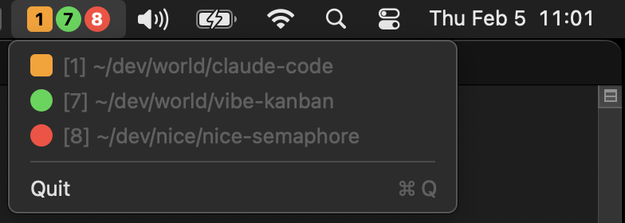

# Nice Semaphore

A macOS menu bar app that monitors running Claude Code instances and displays their status.



Be alerted when a Claude Code instance is working (orange), needs input (red), or when it's complete and needs new instructions (green).

The current version is optimized for a workstation setup where:
* You're using multiple spaces, and have tend to keep one or a few Claude Code instances in each space
* You're running Claude Code CLI in iTerm2

## Features

- **Colored status indicators** - Colored boxes show each instance's state at a glance
- **Space numbers** - Shows which macOS Space each instance is on (if running in iTerm2)
- **Focus detection** - Highlights the currently focused instance (rounded square vs circle)
- **Real-time updates** - Status changes appear immediately via Claude Code hooks

## Status colors

| Status | Color | Meaning |
|--------|-------|---------|
| Working | Orange | Claude is processing/using tools |
| Waiting | Yellow | Claude needs your input (question or permission prompt) |
| Idle | Green | Turn complete, ready for next prompt |

# How It Works

Nice Semaphore has two components that communicate via a JSON status file:

### 1. Hook Script (writes status)

Claude Code [hooks](https://docs.anthropic.com/en/docs/claude-code/hooks) trigger shell commands on specific events. The `nice-semaphore-status.sh` hook script runs on each event and updates `~/.claude/nice-semaphore-status.json` with the current state of each Claude instance.

| Hook | Status Change |
|------|---------------|
| `SessionStart` | Adds instance, sets to **idle** |
| `UserPromptSubmit` | Sets to **working** |
| `PreToolUse` | If AskUserQuestion/ExitPlanMode, sets to **waiting** |
| `PostToolUse` | Ensures **working** state after tool completes |
| `Notification` | If permission prompt, sets to **waiting** |
| `Stop` | Sets to **idle** (turn complete) |
| `SessionEnd` | Removes instance |

The status file stores each instance's session ID, project path, status, PID, and TTY (for focus detection).

### 2. Menu Bar App (reads status)

The Swift app monitors `~/.claude/nice-semaphore-status.json` for changes using a `DispatchSource` file watcher. When the file changes, it:

1. Parses the JSON to get all active instances
2. Detects which instance is focused (by matching TTYs to the frontmost terminal window)
3. Looks up Space numbers using macOS private CGS APIs
4. Renders colored indicators in the menu bar

The menu bar shows colored shapes with Space numbers. Click to see the full list with project paths.


# Installation

## Requirements

- macOS 13+
- Claude Code CLI
- iTerm2 (for focus detection)
- `jq` (usually pre-installed on macOS)

## Install manually via repo

### 1. Clone the repo

```sh
git clone https://github.com/nice-computer/nice-semaphore.git
cd nice-semaphore
```

### 2. Build

```sh
swift build -c release
```

### 2. Install the hooks

```sh
./install-hooks.sh
```

This installs a hook script to `~/.claude/hooks/` and configures Claude Code to call it on session events. Your existing `~/.claude/settings.json` is backed up before modification.

### 3. Run the app

```sh
swift run -c release
```

To run at login, add the binary to System Settings > General > Login Items:
```
.build/release/NiceSemaphore
```

### 4. Restart Claude Code instances

Because Claude Code only reloads hooks on startup, you'll need to restart any Claude Code instances you'd like tracked.

You can resume an exited Claude Code session by running `claude --continue` in the same working directory.


## Install with homebrew

Coming soon.


# Uninstallation

Remove the hooks from `~/.claude/settings.json`:

```json
{
  "hooks": {
    "SessionStart": [...],
    "UserPromptSubmit": [...],
    "PreToolUse": [...],
    "PostToolUse": [...],
    "Notification": [...],
    "Stop": [...],
    "SessionEnd": [...]
  }
}
```

Optionally delete:
- `~/.claude/hooks/nice-semaphore-status.sh`
- `~/.claude/nice-semaphore-status.json`

# Roadmap

* Iron out bugs
* Install hooks as Claude Code plugin
* macOS app image
* Support terminals other than iTerm
* Support remote Claude Code instances
* Support other coding agents (Codex, Gemini, OpenCode, Aider, etc)

# Developing

## Requirements

* Homebrew
* ```sh
  brew install bats-core
  ```

## Testing

Run the test suite:

```sh
make test
```

Tests are written using [Bats](https://github.com/bats-core/bats-core) and cover the hook script's state transitions.

## Debugging

### Enable hook logging

Set the `NICE_SEMAPHORE_DEBUG` environment variable in the terminal session before starting Claude Code:

```sh
export NICE_SEMAPHORE_DEBUG=1
claude
```

The hook script inherits the environment from the Claude Code process, so the variable must be set before `claude` starts. To enable permanently, add the export to your `~/.zshrc` or `~/.bashrc`.

Logs are written to `/tmp/nice-semaphore.log`:

```sh
tail -f /tmp/nice-semaphore.log
```

### Inspect the status file

View the current state of all tracked instances:

```sh
cat ~/.claude/nice-semaphore-status.json | jq
```

### Test the hook script manually

Simulate a hook event:

```sh
echo '{"session_id": "test-123", "cwd": "/tmp/test", "hook_event_name": "SessionStart"}' | ~/.claude/hooks/nice-semaphore-status.sh
```

### Verify hooks are installed

Check that hooks are configured in Claude Code settings:

```sh
cat ~/.claude/settings.json | jq '.hooks'
```

# Acknowledgments

* **[SpaceId](https://github.com/dshnkao/SpaceId/)**  
  A macOS menu bar app that shows the current Space number.
* **[yabai](https://github.com/asmvik/yabai)** and **[skhd](https://github.com/asmvik/skhd)**  
  for i3wm-like tiling window management on macOS, keyboard driven and space aware
* **[i3wm](https://i3wm.org/)**  
  The og X11 tiling window manager


# Sponsors

Thanks to:

* **[Nice Computer Company (nicecomputer.company)](https://nicecomputer.company/)** for sponsoring the coffee ☕️
* **[Autographical (autographical.ai)](https://autographical.ai/)** for the context engineering 🧠
